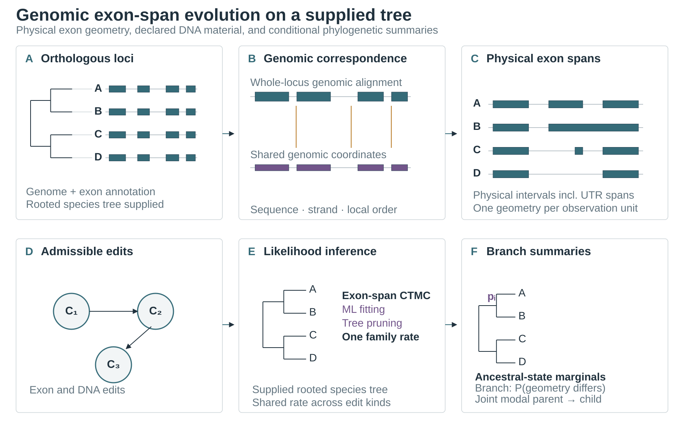

# IntraPhy

IntraPhy's default `analyze` route estimates evolutionary changes in annotated
genomic exon spans for selected homologous gene families on a supplied species
tree. It uses genomic FASTA and existing gene annotations to map physical exon
intervals across species by sequence homology and local genomic geometry.
Repeated transcript aliases for the same physical interval are counted once;
distinct overlapping annotations remain separate observations and can be
unknown locally when their structure conflicts. Missing annotation and
unresolved mapping remain unknown.

The model follows exon-span structure, including terminal and UTR exons when
annotated. Exon starts and ends provide structural boundaries; terminal ends do
not automatically imply splice donor or acceptor function. Coordinates,
strand, and order define genomic context; CDS phase is retained as annotation
metadata. IntraPhy does not infer
RNA transcript usage, isoform abundance, or splicing measurements. Its fitted
rates and ancestral histories are conditional on the selected annotation,
catalogue, supplied tree, and finite edit graph. See the
[genomic exon-span model](docs/genomic_exon_model.md).

## From genomic inputs to correspondence evidence

Provide per-species genomic FASTA and matching GFF3/GFF/GTF files, with a rooted
species tree. File stems identify species and must match tree-tip names. For a
whole-genome annotation, `--orthologs` selects one gene locus per species for
each family; orthology is supplied by the user. For already selected
annotations containing one gene locus per species, omit `--orthologs`.

```bash
intraphy analyze --fasta genomes --gff annotations \
  --orthologs families --species-tree species_tree.nwk \
  --output-dir exon_result --threads 8
```

`analyze` resolves inputs, prepares selected genomic loci, identifies unique
physical exon spans, derives sequence and geometry correspondence, and fits
the exon-structure CTMC. One nonnegative scalar rate is fitted per family and
shared across all elementary edit kinds and linked local units. Linked units
contribute a composite likelihood. The root geometry prior is uniform over
valid geometries given material origin. Separately, each root or branch
material-origin opportunity has weight one.
`--exon-rates FILE --parameter-mode fixed` evaluates supplied fixed rates.
There is no default state-count cap; `--max-states` and
`--max-origin-scenarios` are explicit limits. Use `check` and `build-case` for
staged input inspection or reuse.
`--threads` defaults to 1 and sets MAFFT/minimap2 preparation threads (MAFFT
uses `--thread N --threadit 0`; `threadtb` stays at its default). During
inference, multiple families run in parallel; for one family, threads schedule
local-unit likelihood and posterior work, capped by the number of eligible
units. Process and thread pools are not nested. Keep OpenMP/BLAS threads at 1.
See [genomic input requirements](docs/inputs.md) and the
[command guide](docs/cli.md) for options and output interpretation.

Each local state combines ordered physical exon spans with the presence state
of declared DNA tracts. The edit graph includes exon split and fusion,
boundary shifts, exonization and inactivation, and DNA insertion or deletion;
one deletion can alter multiple spans in one transition. Results include
`exon_structure_fit.json`, `exon_history.json`,
`exon_structure_summary.tsv`, `ancestral_exon_states.tsv`, and the default
`branch_exon_changes.tsv`. The branch table reports endpoint-based net
structure and declared-DNA-presence change probabilities plus the joint modal
parent/child configuration pairs, retaining exact ties. It does not apply a
probability cutoff or report event counts. Coordinates are local 0-based
half-open alignment spans; `alignment_offset` locates them on the shared
alignment axis, while `exon_coordinates.tsv` and `exon_correspondence.tsv`
provide links to observed native exon coordinates. DNA-presence summaries
cover only declared material tracts. `--expected-edits` additionally writes
`branch_exon_events.tsv` with conditional model edit counts.

The finite catalogue conditions inference on supplied annotations and mapped
exon spans. Annotation discovery is not corrected for ascertainment. Equal
rates are a constrained baseline for the declared edit graph; results do not
provide a significance test for exon evolution.



See [method schematics](docs/method_schematics.md) for this figure's caption
and the four companion figures.

## Other explicit models

`--model dna-presence-ctmc` and `--model intron-position-ctmc` run separate
binary analyses. They do not contribute states to the default exon model; see
the [CLI guide](docs/cli.md). The advanced `--locus-model` route evaluates a
supplied source-directed DNA-copy catalogue; see the
[locus model reference](docs/exon_structure_model.md).

See [research foundations](docs/research_foundations.md) for relevant literature
and the scope of IntraPhy's structural and phylogenetic analyses.
