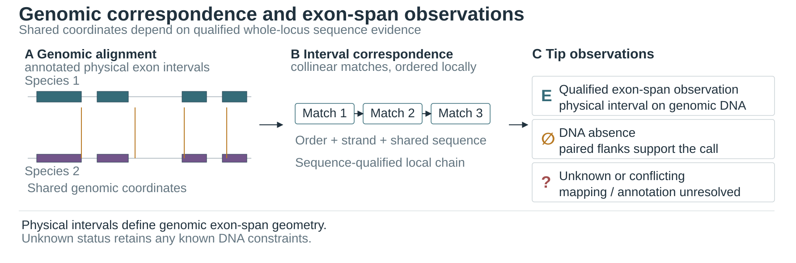
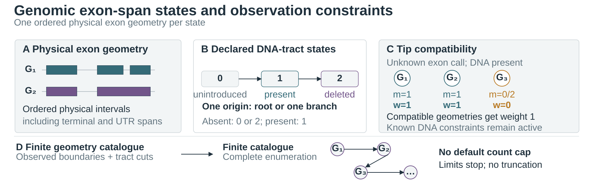
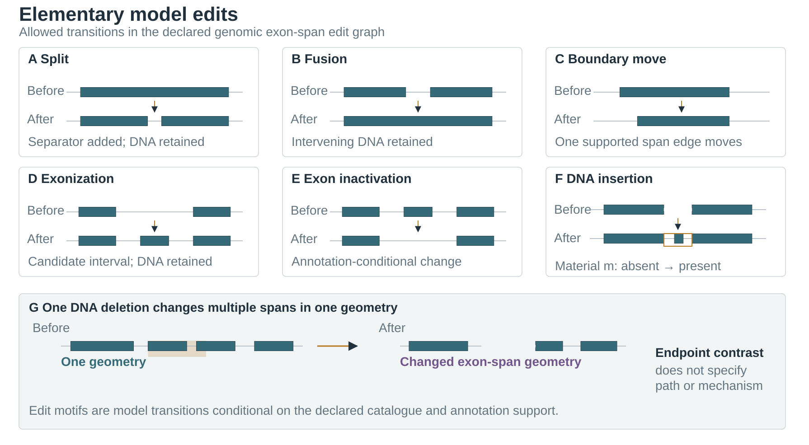
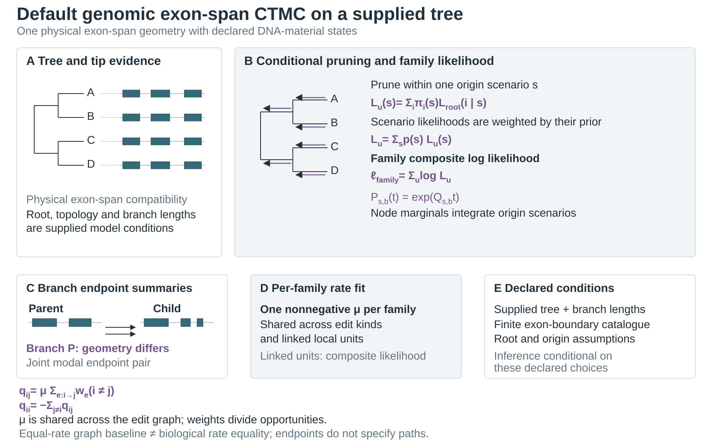

# Method schematics

The five schematics describe the default `exon-structure-ctmc` analysis of
annotated physical exon spans. Whole-locus genomic alignment supports sequence
correspondence; each observation unit has one local exon-span geometry together
with presence states for declared DNA material tracts. Terminal and UTR spans
are retained. The model does not infer RNA abundance, transcript use, splicing,
or splice-site function from an exon boundary.

One nonnegative scalar rate is fitted per family and shared across edit kinds
and linked local units. The likelihood conditions on the supplied rooted tree,
branch-length scale, finite boundary/material catalogue, and root/origin
assumptions. Branch output reports endpoint geometry-change probabilities and
joint modal parent/child configurations. These summaries do not estimate the
number of transitions or a molecular mechanism. Optional `--expected-edits`
reports conditional model transition counts, not molecular lesions. For full
model semantics, see the [genomic exon-span model](genomic_exon_model.md).

## Method overview

[SVG](figures/publication/method_scheme.svg) ·
[PDF](figures/publication/method_scheme.pdf) ·
[PNG](figures/publication/method_scheme.png)

The panels follow genomic evidence to physical exon-span observations, the
declared edit graph, default CTMC inference, and endpoint-based summaries.

## Genomic correspondence

[SVG](figures/publication/exon_correspondence.svg) ·
[PDF](figures/publication/exon_correspondence.pdf) ·
[PNG](figures/publication/exon_correspondence.png)

Sequence, native coordinates, strand, and local order support correspondence;
staged protein-projection evidence can provide corroboration when available.
CDS phase is retained as annotation metadata and does not score or qualify a
match. A physical interval is one genomic exon-span observation after aliases
of that interval are deduplicated. DNA absence requires qualified sequence
support; missing, ambiguous, or conflicting evidence remains unknown.

## State space and observations

[SVG](figures/publication/structural_states.svg) ·
[PDF](figures/publication/structural_states.pdf) ·
[PNG](figures/publication/structural_states.png)

Each declared variable DNA tract has states 0 (unintroduced), 1 (present), and
2 (deleted), with one origin at the root or on one branch. Tip absence is
compatible with states 0 and 2; tip presence requires state 1. Unknown exon
status retains any recorded DNA-presence constraints. The state space is
complete conditional on observed boundaries and declared tract cuts; there is
no default state-count cap.

## Model edits

[SVG](figures/publication/evolutionary_events.svg) ·
[PDF](figures/publication/evolutionary_events.pdf) ·
[PNG](figures/publication/evolutionary_events.png)

These motifs depict model transitions conditional on the declared catalogue
and annotation support. The deletion panel shows one geometry before and after
a DNA deletion that changes multiple exon spans. Endpoint differences do not
identify an evolutionary path, transition count, or molecular mechanism.

## Phylogenetic inference

[SVG](figures/publication/phylogenetic_inference.svg) ·
[PDF](figures/publication/phylogenetic_inference.pdf) ·
[PNG](figures/publication/phylogenetic_inference.png)

Pruning conditions on one material-origin scenario at a time. Scenario
likelihoods are weighted by their prior; linked local units then contribute to
the family composite log likelihood. One nonnegative rate is fitted per family
and shared across edit kinds and linked units. Branch outputs give the
probability that parent and child exon geometries differ and list joint modal
endpoint configurations. Conditional transition-count expectations are
optional and are not counts of molecular lesions.
